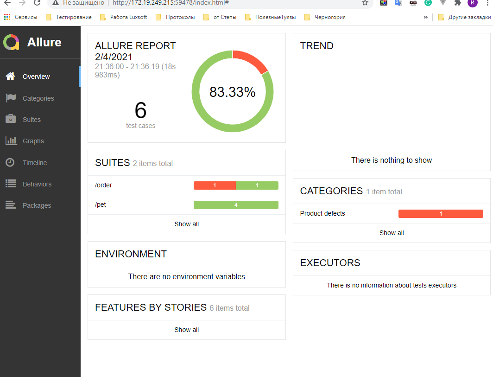
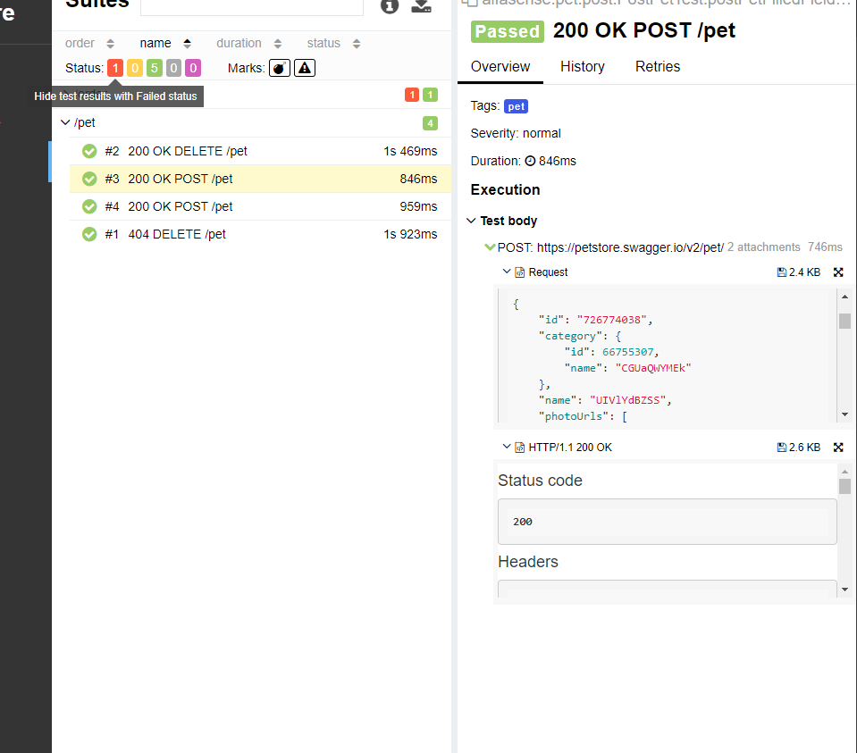
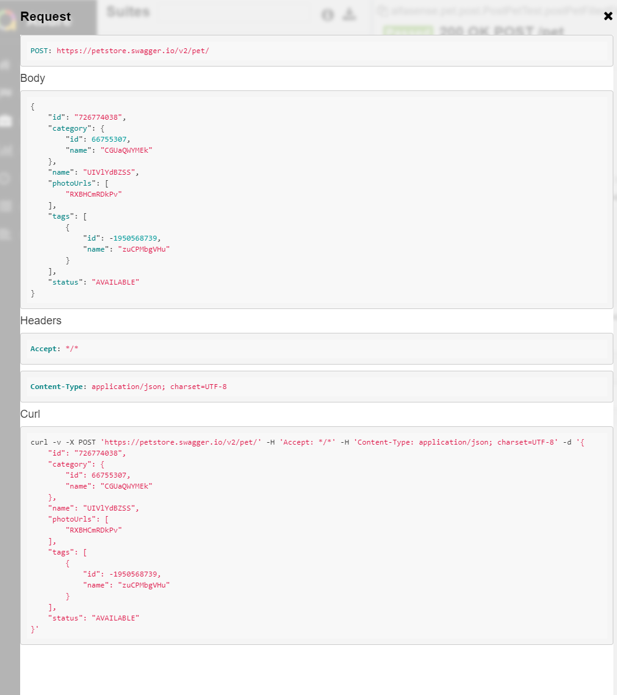
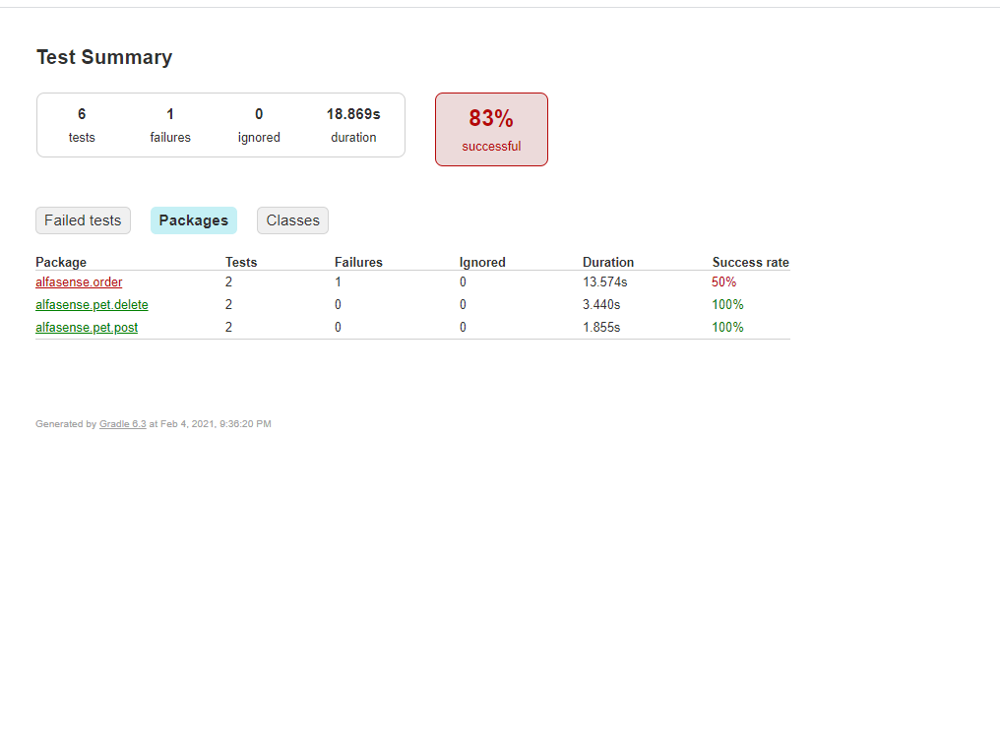

##AlfaSense        
This is simple test framework which include allure report, idea report.
Also, we can launch our application with other parameters.
                   
#### 1. First approach to change the general url before tests will be launch. 
- [X] You can do it with the help application.yaml
Find element url in this file and just replace base url and launch the tests
```
url: USE YOUR BASE URL

alfasense:
  api:
    baseUrl: https://${url}/v2/
```
#### 2. Second approach to change the general url before tests will be launch.
- [X] You can do it with the help gradle and variable "host"
Open your terminal and write it in your console
```
.\gradlew test -Dhost=http:\\YOUR BASE URL\
```
or 
```
gradle test -Dhost=http:\\YOUR BASE URL\
```

The framework include generation allure report and gradle reports.
If you want to generate Allure report you have to install Allure ClI.

- [X] After Allure ClI will be installed to generate report use the next command :
   ```
   allure serve and full path to your directory 

   example 
  allure serve C:\Users\IPylnev\IdeaProjects\AlfaSense\build\reports\allure-results
   ```

##There is Allure report
<p align="center">

</p>
<!--  -->

##There is Allure report

<p align="center">

</p>
<!--  -->

##There is Allure report

<p align="center">

</p>
<!--  -->


##There is gradle report
<p align="center">

</p>
<!--  -->


###Framework to be able to launch other Test Suite.  
If you want run only ones endpoint use the following command in your terminal:

- [X] This one for test pet url
```
gradle petTest
``` 
- [X] This one for test store url 
```
gradle storeTest
``` 

By the way you can combine all these parameters
```
gradle  petTest -Dhost=http:\\YOUR BASE URL\

``` 
